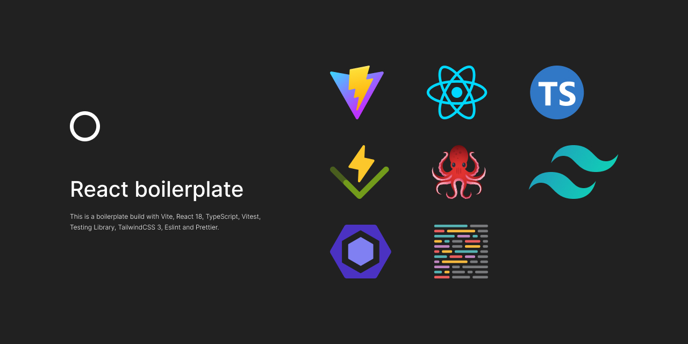

# Vite React Boilerplate



## Table of Contents

- [Requirements](#1-requirements)
- [Technologies Used](#2-technologies-used)
- [Installation](#3-installation)
- [Running the Project](#4-running-the-project)
- [Testing](#5-testing)
  - [Running Tests](#running-tests)
  - [Writing Tests](#writing-tests)
- [Preparing for Deployment](#6-preparing-for-deployment)
  - [Without Docker](#without-docker)
  - [With Docker](#with-docker)
- [Project Structure](#7-project-structure)
- [Installed Packages](#8-installed-packages)
  - [Base](#base)
  - [Routing](#routing)
  - [Linting & Formatting](#linting--formatting)
  - [UI](#ui)
  - [Forms](#forms)
  - [Testing](#testing-1)
  - [Git](#git)
- [Scripts](#9-scripts)

---

### 1. Requirements

- NodeJS 18+
- pnpm (or equivalent)

### 2. Technologies Used

- **React**: A modern front-end JavaScript library for building user interfaces based on components.
- **Vite**: A fast build tool and development server for modern web projects.
- **vitest** : A blazing fast unit test framework powered by Vite.
- **TypeScript**: A superset of JavaScript that adds static typing.
- **Docker**: Supports containerization for seamless deployment across different environments.
- **Axios** : A promise-based HTTP client for making API requests.
- **TanStack Router** - Fully typesafe, modern and scalable routing for React applications.
- **Redux** - A state management tool for JavaScript apps that keeps your app’s state predictable and centralized, making it easier to manage and debug. It’s ideal for large or complex applications where state needs to be shared among many components.
- **context api** - A simple React tool for sharing state across components without props. It’s great for state management in small or simple projects, such as single-page applications or basic components where a lightweight solution is sufficient.
- **pnpm**: A fast and disk space-efficient package manager.
- **React Hook Form**- Performant, flexible and extensible forms with easy-to-use validation.
- **ESLint**: A linter for identifying and fixing problems in your code.
- **husky** : Git hooks and commit linting to ensure use of descriptive and practical commit messages.
- **Prettier** : An opinionated code formatter.
- **Tailwind CSS** : A utility-first CSS framework packed with classes to build any web design imaginable.

### 3. Installation

To install and run the project locally, follow these steps:

1. **Clone the repository:**

   ```bash
   git clone https://github.com/ashangrajapaksha/boilerplate-react-vite.git
   ```

2. **Navigate to the project directory:**

   ```bash
   cd boilerplate-react-vite
   ```

3. **Install the dependencies:**

   ```bash
   pnpm install
   ```

### 4. Running the Project

To start the development server, use the following command:

```bash
pnpm run dev
```

### 5. Testing

This project uses Vitest for unit and integration testing.

#### Running Tests

To run the tests, use the following command:

```bash
pnpm run test
```

#### Writing Tests

Tests are typically located alongside the files they are testing and follow the naming convention \*.test.ts. Here’s an example of a simple test:

```bash
import { describe, it, expect } from 'vitest'; // Import necessary functions from Vitest
import { add } from './helpers'; // Import the 'add' function from the specific file

describe('add function', () => {
  it('should return the correct sum of two numbers', () => {
    expect(add(2, 3)).toBe(5);
    expect(add(-1, 1)).toBe(0);
    expect(add(0, 0)).toBe(0);
  });
});
```

### 6. Preparing for Deployment

### Without Docker

- Development deployment

```bash
pnpm run build
```

- Test deployment

```bash
pnpm run build:test
```

- Production deployment

```bash
pnpm run build:production
```

### With Docker

A Dockerfile with an NGINX base image is also provided for quick and easy deployments. Simply execute the following commands:

```bash
pnpm run build
docker build . -t <container_name>
Example: docker build . -t todo-app
docker run  -p <port_number>:80 <container_name>
Example: docker run -p 8080:80 todo-app
```

### 7. Project Structure

This is the folder and file structure of the project.

```sh
├── .guthub               # Configuration for GitHub-related file (workflow, issue template, PR template)
├── .husky                # Husky configuration for managing Git hooks
├── node_modules          # Installed npm/pnpm packages and dependencies
├── public                # Public assets like index.html, favicon, and static files
├── src                   # Source code directory
│   ├── assets            # Static assets like images, fonts, etc.
│   ├── components        # React components
│   ├── config            # Configuration files and settings
│   ├── constants         # Constants used throughout the app
│   ├── contextAPI        # Context API files for global state management
│   ├── hooks             # Custom React hooks
│   ├── pages             # Application pages and views
│   ├── routes            # Application routes
│   ├── services          # API services
│   ├── styles            # Global SCSS, or styled-components files
│   ├── types             # TypeScript types and interfaces
│   ├── utils             # Utility functions
│   ├── App.css           # Global CSS for the app
│   ├── App.tsx           # Main React component for the app
│   ├── index.css         # CSS for index.html
│   ├── main.tsx          # Entry point for the React app
│   ├── routeTree.gen.ts  # Generated route tree for the app
│   ├── setupTest.ts      # Setup file for running tests
│   ├── vite-env.d.ts     # Vite-specific environment types
├── .dockerignore         # Specifies files and directories to ignore in the Docker build process
├── .env                  # Environment variables for the default environment
├── .env.dev              # Environment variables for development mode
├── .env.example          # Example of required environment variables
├── .env.prod             # Environment variables for production mode
├── .env.test             # Environment variables for testing
├── .gitignore            # Specifies which files and directories Git should ignore
├── .prettierrc.cjs       # Configuration for Prettier code formatter
├── commitlint.config.cjs # Configuration for enforcing conventional commit messages
├── Dockerfile            # Configuration for building and running the app in a Docker container
├── eslint.config.js      # ESLint configuration for code linting
├── index.html            # Main HTML file for the app
├── package.json          # Project metadata and dependencies
├── pnpm-lock.yaml        # Lock file for pnpm package manager
├── postcss.config.js     # PostCSS configuration for processing CSS
├── README.md             # Documentation for the project
├── tailwind.config.js    # Configuration for Tailwind CSS
├── tsconfig.app.json     # TypeScript configuration specific to the app
├── tsconfig.json         # Global TypeScript configuration
├── tsconfig.node.json    # TypeScript configuration specific to Node.js
├── vite.config.ts        # Configuration for Vite build tool
```

### 8. Installed Packages

These are the main installed packages.

#### Base

- [TypeScript](https://www.typescriptlang.org/)
- [Vite](https://vite.dev/)
- [React](https://react.dev/)

#### Api Call

- [Axios](https://axios-http.com/docs/intro)

#### Routing

- [TanStack Router](https://tanstack.com/router/v1/docs/framework/react/overview)

#### Linting & Formatting

- [ESLint](https://eslint.org/)
- [Prettier](https://prettier.io/)

#### UI

- [Tailwind CSS](https://tailwindcss.com/)

#### Forms

- [React Hook Form](https://react-hook-form.com/)

#### Testing

- [Vitest](https://vitest.dev/)

#### Git

- [Husky](https://github.com/typicode/husky#readme)
- [Commitizen](https://github.com/commitizen/cz-cli#readme)
- [Commitlint](https://github.com/conventional-changelog/commitlint#readme)

### 9. Scripts

A simplified list can be found in the #technologies-used section.

In the `package.json` file, you’ll find a set of scripts that automate common tasks for your development workflow. Here’s a brief overview of each script:

```json
  "scripts": {
    "start": "pnpm vite",
    "build": "pnpm vite build",
    "build:local": "pnpm run setup:env:local && pnpm vite build",
    "build:production": "pnpm run setup:env:production && pnpm vite build",
    "build:test": "pnpm run setup:env:test && pnpm vite build",
    "setup:env:local": "cp .env.local .env",
    "setup:env:production": "cp .env.production .env",
    "setup:env:test": "cp .env.test .env",
    "preview": "vite preview",
    "dev": "pnpm vite",
    "lint": "eslint .",
    "lint:fix": "eslint src --fix",
    "format": "prettier --write 'src/**/*.ts'",
    "prepare": "husky install",
    "test": "vitest"
  },
```

---

###### In this template, you'll find sample components demonstrating how to use Axios for API calls, handle state with the Context API, and manage state with Redux. These examples are designed to help you understand how to implement these tools effectively.

###### When starting a new project with this boilerplate, feel free to remove any unwanted components. However, we recommend keeping these samples until you have a solid understanding of their usage.
